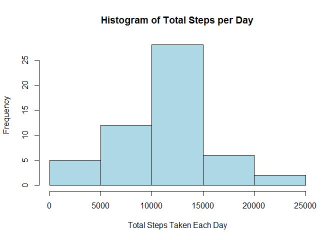
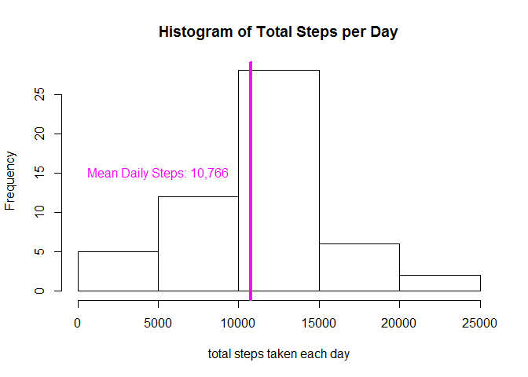
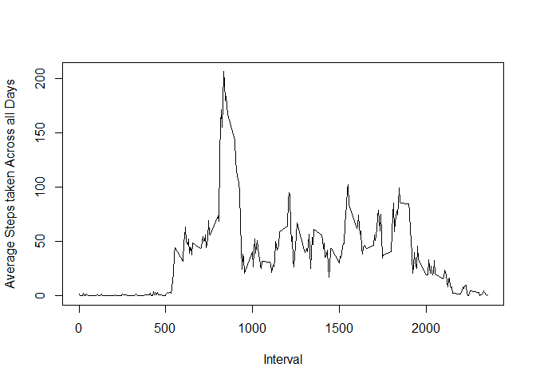
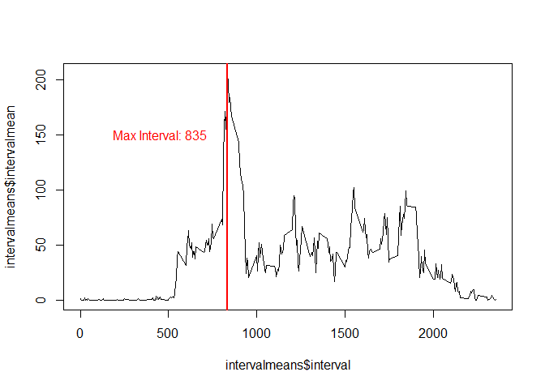
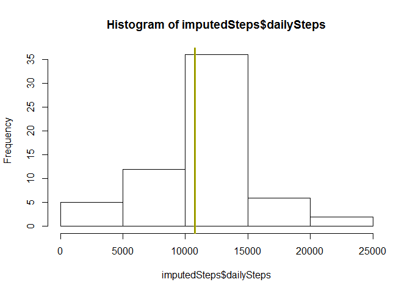
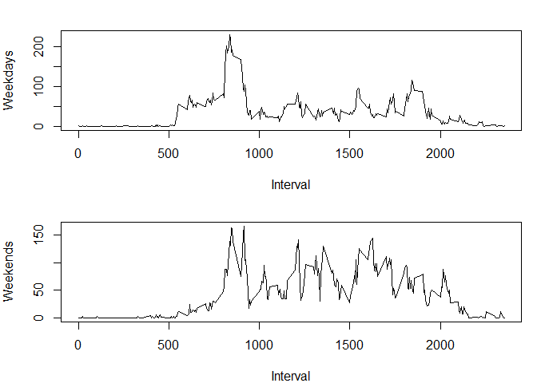

# Reproducible Research: Peer Assessment 1

### By: Lauren Rollheiser
## Loading and preprocessing the data

The data is in a zip file within the working directory. Initial steps are to unzip the file and read in the dataset, labeled *activity*. (Note: variable names are italicized for clarity) The date column is also formatted using the as.Date function.


```r
unzip("activity.zip")
activity <- read.csv("activity.csv", na.strings = "NA", header = TRUE, stringsAsFactors = FALSE)
activity$date <- as.Date(activity$date)
head(activity)
```

```
##   steps       date interval
## 1    NA 2012-10-01        0
## 2    NA 2012-10-01        5
## 3    NA 2012-10-01       10
## 4    NA 2012-10-01       15
## 5    NA 2012-10-01       20
## 6    NA 2012-10-01       25
```
The dataset includes the number of steps taken by a subject broken into 5 minute intervals from the dates 2012-10-01 to 2012-11-30. 

**Variables in the Dataset Include**  
1. Steps: indicates the total steps taken during the observation.  
2. Date: gives the year-month-day of the observation.  
3. Interval: an integer from 0 to 2355 in increments of 5. Each interval reprsents 5 minutes and indicates time of day with 0 representing the start time for a 24 hour period.  

## What is mean total number of steps taken per day?

To find the total number per day, NA's were first eliminated and the dataset labeled *activityComplete*.

Next, the dplyr package is loaded and the dataset is grouped into days. The final table, *totalsteps*, gives a summary analysis of the sum of all steps for each day in the *activityComplete* dataset. The table includes each day of observation with the total number of recorded steps for that day.


```r
missing <- is.na(activity$steps)
activityComplete <- activity[!missing, ]
library(dplyr)
```

```
## 
## Attaching package: 'dplyr'
## 
## The following object is masked from 'package:stats':
## 
##     filter
## 
## The following objects are masked from 'package:base':
## 
##     intersect, setdiff, setequal, union
```

```r
days <- group_by(activityComplete, date)
totalsteps <- summarize(days, totalsteps = sum(steps, na.rm = TRUE))
head(totalsteps)
```

```
## Source: local data frame [6 x 2]
## 
##         date totalsteps
## 1 2012-10-02        126
## 2 2012-10-03      11352
## 3 2012-10-04      12116
## 4 2012-10-05      13294
## 5 2012-10-06      15420
## 6 2012-10-07      11015
```

**Make a histogram of total number of steps taken each day.**  
For this step, the base ploting sytem was used.


```r
hist(totalsteps$totalsteps, xlab = "Total Steps Taken Each Day", main = "Histogram of Total Steps per Day", col = "light blue")
```

 

**Calculate mean and median of steps taken per day.**


```r
meansteps <- mean(totalsteps$totalsteps, na.rm = TRUE)
meansteps
```

```
## [1] 10766.19
```
The mean steps taken per day is indicated with the magenta line. 


```r
hist(totalsteps$totalsteps, xlab = "total steps taken each day", main = "Histogram of Total Steps per Day")
abline(v = meansteps, col = "magenta", lwd = 4)
text(x = 5000, y = 15, labels = "Mean Daily Steps: 10,766", col = "magenta")
```

 


```r
mediansteps <- median(totalsteps$totalsteps, na.rm = TRUE)
mediansteps
```

```
## [1] 10765
```
The median number of steps taken per day is 10765 and is represented in the graph below with the purple line. 


```r
hist(totalsteps$totalsteps, xlab = "total steps taken each day", main = "Histogram of Total Steps per Day")
abline(v = mediansteps, col = "purple", lwd = 4)
text(4600, 15, labels = "Median Daily Steps: 10,765", col = "purple")
```

 


## What is the average daily activity pattern?

The *activity* dataset is grouped by the interval variable and summarized with the mean, this returns the *intervalmeans* dataframe with the calculated mean number of steps taken for each 5 minute interval across all observed days. 

A line plot is constructed using the base plotting system to show the variation in activity level dependent on time of day.

```r
intervals <- group_by(activity, interval)
intervalmeans <- summarize(intervals, intervalmean = mean(steps, na.rm = TRUE))

plot(intervalmeans$interval, intervalmeans$intervalmean, type = "l", xlab = "Interval", ylab = "Average Steps taken Across all Days")
```

 


2. Which 5-minute interval, on average across all the days in the dataset, contains the maximum number of steps?

The *maxsteps* variable identifies the observation of max steps taken in the *intervalmean* dataframe. The graph below show the interval at which the most steps are recorded on average for all days.


```r
maxsteps <- filter(intervalmeans, intervalmean == max(intervalmeans$intervalmean))
maxsteps[,1]
```

```
## Source: local data frame [1 x 1]
## 
##   interval
## 1      835
```

```r
plot(intervalmeans$interval, intervalmeans$intervalmean, type = "l")
abline(v = maxsteps$interval, col = "red", lwd = 2)
text(x = 450, y = 150, labels = "Max Interval: 835", col = "red")
```

 


## Imputing missing values


First I look to verify that the steps variable is the only variable with NA's. Because this is the case, taking the sum of NA's in the steps variable includes all those in the dataset.


```r
any(is.na(activity$date))
```

```
## [1] FALSE
```

```r
any(is.na(activity$interval))
```

```
## [1] FALSE
```

```r
any(is.na(activity$steps))
```

```
## [1] TRUE
```

```r
allNA <- sum(is.na(activity$steps))
```
The dataset contains 2304 missing values, all of which appear in the steps variable.

###2. Devise a strategy for filling in all of the missing values in the dataset. 

First, data is copied to a new dataframe called *activityfilled* which will be imputed with step variables for all missing values. A for loop is used to imput values for the NA's. The loop searches for an NA in the steps variable for each observation, if it finds an NA, it will find the average steps recorded for that interval calculated in the *intervalmeans* table. This value is plugged in for the NA for that observation. 


```r
activityfilled <- activity
for(i in 1:17568) {
      if(is.na(activityfilled$steps[i])) {
        value <- filter(intervalmeans, interval == activityfilled$interval[i])    
        activityfilled$steps[i] <- as.numeric(value[,2])
      }
}
```


```r
head(activityfilled)
```

```
##       steps       date interval
## 1 1.7169811 2012-10-01        0
## 2 0.3396226 2012-10-01        5
## 3 0.1320755 2012-10-01       10
## 4 0.1509434 2012-10-01       15
## 5 0.0754717 2012-10-01       20
## 6 2.0943396 2012-10-01       25
```

```r
tail(activityfilled)
```

```
##           steps       date interval
## 17563 2.6037736 2012-11-30     2330
## 17564 4.6981132 2012-11-30     2335
## 17565 3.3018868 2012-11-30     2340
## 17566 0.6415094 2012-11-30     2345
## 17567 0.2264151 2012-11-30     2350
## 17568 1.0754717 2012-11-30     2355
```

```r
str(activityfilled)
```

```
## 'data.frame':	17568 obs. of  3 variables:
##  $ steps   : num  1.717 0.3396 0.1321 0.1509 0.0755 ...
##  $ date    : Date, format: "2012-10-01" "2012-10-01" ...
##  $ interval: int  0 5 10 15 20 25 30 35 40 45 ...
```

```r
any(is.na(activityfilled))
```

```
## [1] FALSE
```


##Make a histogram of the total number of steps taken each day and Calculate and report the mean and median total number of steps taken per day. Do these values differ from the estimates from the first part of the assignment? What is the impact of imputing missing data on the estimates of the total daily number of steps?


The *activityfilled* dataset is grouped by date and the new total is found. 

```r
imputDays <- group_by(activityfilled, date)
imputedSteps <- summarize(imputDays, dailySteps = sum(steps))

hist(imputedSteps$dailySteps)

abline(v = mean(imputedSteps$dailySteps), col = "yellow", lwd = 3)
text(x = 450, y = 1000, labels = "Mean: ", col = "yellow")
abline(v = median(imputedSteps$dailySteps), col = "black", lwd = .5)
text(x = 450, y = 1500, labels = "Median: ", col = "black")
```

 

```r
mean(imputedSteps$dailySteps)
```

```
## [1] 10766.19
```

```r
median(imputedSteps$dailySteps)
```

```
## [1] 10766.19
```
By imputing missing values with the averages for each interval, the overall pattern remains largely unchanged. The median has now increased by one and is now equal to the mean. 

## Are there differences in activity patterns between weekdays and weekends?

The imputed dataset *activityfilled* is used for this analysis. A new variable called weekday is added to the dataframe and includes the day of the week. A for loop is used to determine if the day falls on a weekend or a weekday and changes the variable to the cooresponding label. The weekday/weekend variable is then converted to a factor. 


```r
activityfilled <- mutate(activityfilled, weekday = weekdays(activityfilled$date))

for(i in 1: 17568){
  if (activityfilled$weekday[i] %in% c("Saturday", "Sunday")){
            activityfilled$weekday[i] <- "weekend"
  } else {
            activityfilled$weekday[i] <- "weekday"
  }
}
activityfilled$weekday <- as.factor(activityfilled$weekday)
```

##Make a panel plot containing a time series plot (i.e. type = "l") of the 5-minute interval (x-axis) and the average number of steps taken, averaged across all weekday days or weekend days (y-axis). 

Overall, it appears weekends have a higher level of activity throughout the day, and generally have a different pattern, which is to be expected. 


```r
weekdayIntervals <- filter(activityfilled, weekday == "weekday") %>% group_by(interval) %>% summarize(avgStepsWeekDay = mean(steps))

weekendIntervals <- filter(activityfilled, weekday == "weekend") %>% group_by(interval) %>% summarize(avgStepsWeekEnd = mean(steps))
par(mfrow = c(2,1), mar = c(4, 4, 2, 1))
plot(weekdayIntervals$interval, weekdayIntervals$avgStepsWeekDay, type = "l", ylab = "Weekdays", xlab = "Interval")
plot(weekendIntervals$interval, weekendIntervals$avgStepsWeekEnd, type = "l", ylab = "Weekends", xlab = "Interval")
```

 

